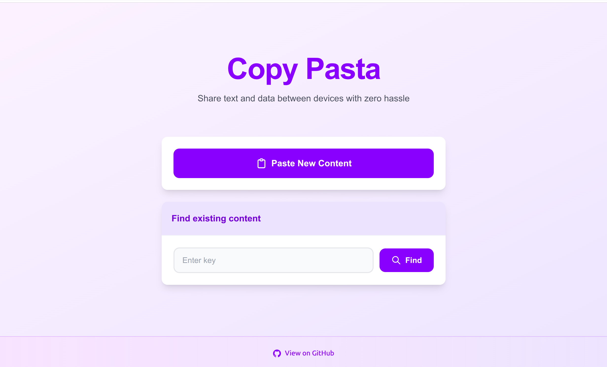

<p align="center"><h1 align="center">COPY PASTA</h1></p>
<h3 align="center">
Check out: <a href="https://copypasta.asiradnan.com/">https://copypasta.asiradnan.com/</a>
</h3>
<p align="center">Built with the tools and technologies:</p>
<p align="center">
    
    
    
	
    
</p>
<br>
<p align="center">
  
</p>

##  Table of Contents
- [Table of Contents](#table-of-contents)
- [Overview](#overview)
- [Tech](#tech)
- [Features](#features)
- [Project Structure](#project-structure)
- [Getting Started](#getting-started)
  - [Prerequisites](#prerequisites)
  - [Installation](#installation)
  - [Testing](#testing)
- [License](#license)
##  Overview
 Ever needed to quickly transfer text or files between your phone and a desktop without the hassle of cables, software installations, or risky logins? CopyPasta makes it simple.

---

## Tech
- **Backend:** Python, Django
- **Frontend:** HTML, CSS, JavaScript, Django Templates
- **Database:** PostgreSQL
- **Testing:** Python Unittest, Django Test, Coverage
- **CI/CD:** GitHub Actions for Continuous Integration and Deployment 
- **Hosting:** Amazon EC2, Gunicorn, Nginx
- **Media:** Amazon S3, Amazon CloudFront


##  Features

- **Quick Transfers:** Paste on one device, retrieve from another with your custom key.
- **Secure & Private:** Delete your content after use to prevent unauthorized access.
- **Persistent Keys:** Use the same key repeatedly to update or replace content.
- **No Installations Needed:** Works directly in the browser without extra software.


##  Project Structure

```sh
└── CopyPasta/
    ├── .github
    │   └── workflows
    ├── CopyPaste
    │   ├── __init__.py
    │   ├── asgi.py
    │   ├── settings.py
    │   ├── test_settings.py
    │   ├── urls.py
    │   └── wsgi.py
    ├── LICENSE
    ├── Main
    │   ├── __init__.py
    │   ├── admin.py
    │   ├── apps.py
    │   ├── forms.py
    │   ├── migrations
    │   ├── models.py
    │   ├── tests
    │   ├── urls.py
    │   └── views.py
    ├── README.md
    ├── manage.py
    ├── requirements.txt
    ├── static
    │   └── paste.png
    └── templates
        ├── base.html
        ├── copy.html
        ├── home.html
        ├── paste.html
        └── pasted.html
```

##  Getting Started

###  Prerequisites

Before getting started with CopyPasta, ensure your runtime environment meets the following requirements:

- **Programming Language:** Python
- **Package Manager:** Pip


###  Installation

Install CopyPasta using one of the following methods:

**Build from source:**

1. Clone the CopyPasta repository:
```sh
git clone https://github.com/asiradnan/CopyPasta
```

2. Navigate to the project directory:
```sh
cd CopyPasta
```

3. Install the project dependencies:


**Using `pip`** 
```sh
pip install -r requirements.txt
```

4. Run the project:
```sh
python manage.py runserver
```

###  Testing
Run the test suite using the following command:
```sh
coverage run manage.py test --settings=CopyPaste.test_settings
```

##  License

This project is protected under the [MIT](https://choosealicense.com/licenses/mit/) License. For more details, refer to the [LICENSE](https://github.com/asiradnan/CopyPasta/blob/main/LICENSE) file.

---